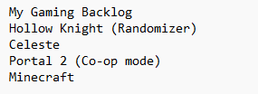
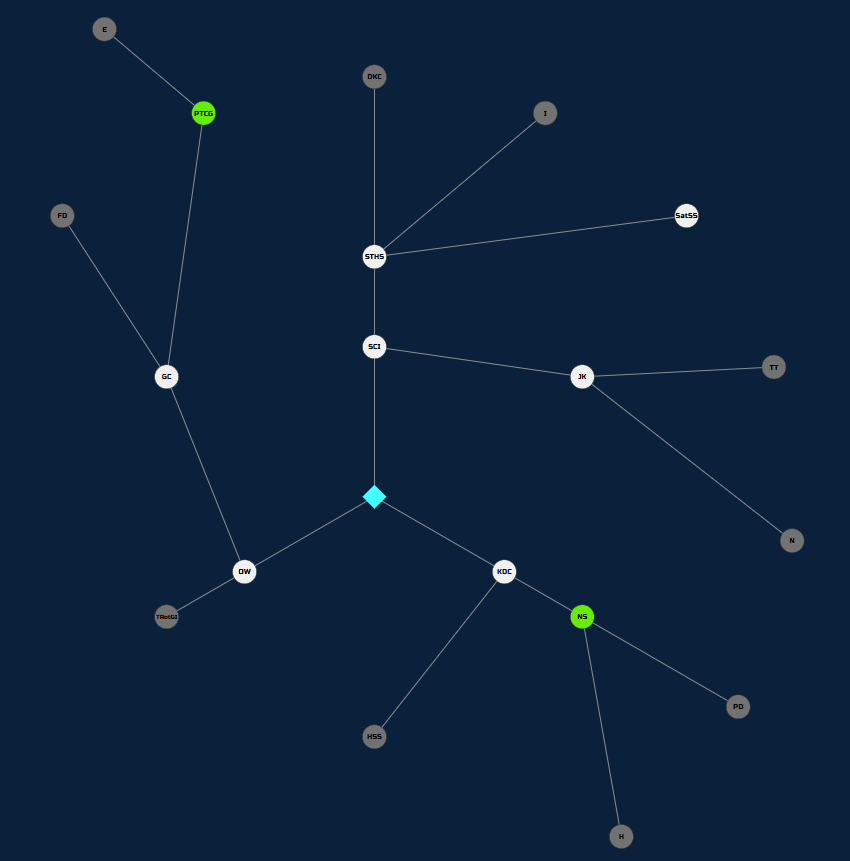

# Game Skill Tree

Turn your game backlog into an interactive skill tree!  
Track your progress, unlock games, and make completing your backlog more fun.

---

## Features
- Create custom skill trees from a simple text file.
- Click nodes to view game details, unlock games, and mark them as complete.
- Game images will automatically display based on inputted title.
- Track completion rate as a fraction or percentage.
- Share and backup your trees.
- Smooth panning, zooming, and easy navigation.

---

## Getting Started

### 1. Create a Tree File
- Use a `.txt` file (Notepad works fine).
- The **first line** is the tree title.
- Each **subsequent line** is a game title.
- Add **subtitles in parentheses** for optional goals (e.g., randomizer mode, true ending).  
  Subtitles will not affect images.
  
Here is an example text file:

### 2. Upload Your Tree
1. Open the app.
2. Click **New Tree** and upload your `.txt` file.
3. The app will create a file in: resources/app/trees
4. Share this file with others by having them copy it into their own `trees` folder.

### 3. Explore Your Tree
- Click on nodes to view details, unlock games, and track progress.
- **Node colors**:
- **Green** → Unlocked but not completed
- **White** → Completed
- **Gray** → Locked
- Use panning, zooming, and the Home button to navigate.

### 4. Track Your Completion
- Your completion rate is shown in the **top-right** corner.
- Click it to toggle between fraction and **percentage.

### 5. Settings
- Mostly for debugging.
- Use this if errors occur or when updating the application to fix tree data.
- Also includes a refresher on the instructions.

---

## Installation

- Check out the releases page. The newest one should have the highest version tag.
- Download the zipped folder. If you want to develope your own, download the source code and related dependencies.
- Once downloaded, unzip the folder and the application will be inside of it.

## Disclaimer

This project uses links to publicly available images hosted by **Steam** and **RAWG** to display game covers and artwork.  
No images are redistributed, and all images are cached locally on the user's machine.

All trademarks and copyrighted materials are the property of their respective owners.  
This project is for **personal and educational purposes only** and is not affiliated with or endorsed by **Valve Corporation**, **RAWG**, or any respective game publishers or artists.

## License

This project is licensed under the **MIT License** – see the [LICENSE](LICENSE) file for details.

